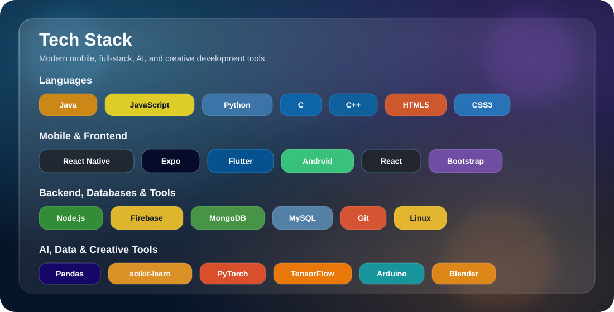
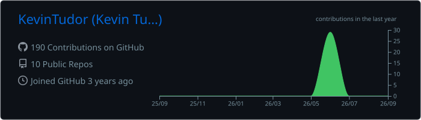
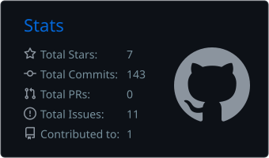
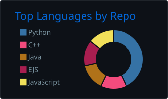
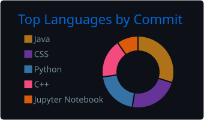

<h1 align="center">Hi 👋, I'm Kevin Tudor</h1>

  <b>Computer Science graduate from Florida Atlantic University</b> 
  B.S. in Computer Science • Minor in Artificial Intelligence

  

---

## About Me

* 🔭 I’m currently working on a **mobile application using JavaScript, React Native, and Expo**
  [View the project](https://github.com/KevinTudor/AAA_MobileApp.git)

* 🌱 I’m currently learning **Java**, **Flutter**, and refreshing my **Python AI tooling**

* 👯 I’m interested in collaborating on **AI** and **Full-Stack Development** projects

* 🤝 I’m looking for help with **locally distributing an iOS `.ipa` file**

* 👨‍💻 All of my projects are available on my [GitHub profile](https://github.com/KevinTudor?tab=repositories)

---

## Tech Stack

  

---

## GitHub Stats

  

<table align="center" width="100%">
  <tr>
    <td align="center" width="33%">
      
    </td>
    <td align="center" width="33%">
      
    </td>
    <td align="center" width="33%">
      
    </td>
  </tr>
</table>

---

## Connect With Me

  

  

